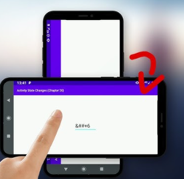
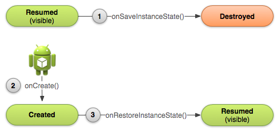

#  App Contador de Cliques (Android - Java)

Este projeto foi desenvolvido com fins **educacionais**, como parte da disciplina de **Dispositivos Móveis**. Ele apresenta, de forma simples e gradual, a criação de um aplicativo Android que **conta cliques** na tela e **salva o valor mesmo após o app ser fechado ou o celular ser rotacionado**.

Cada etapa foi versionada com Git para facilitar o acompanhamento e o entendimento dos conceitos envolvidos.

---

##  Funcionalidade

Ao abrir o app, um número aparece centralizado na tela.

- A cada clique sobre o número, ele aumenta em 1.
- Se o celular for rotacionado, o número continua do ponto em que estava.
- Se o app for fechado e aberto novamente, o número também continua do ponto anterior.

---
## 📖 Introdução
Este projeto é um exemplo simples de um aplicativo Android que conta cliques na tela. Ele foi desenvolvido para ensinar conceitos básicos de desenvolvimento Android, como o ciclo de vida de uma Activity, manipulação de componentes de interface do usuário e persistência de dados.

O aplicativo exibe um número centralizado na tela, que é incrementado a cada clique do usuário. Além disso, o valor do contador é mantido mesmo após a rotação do dispositivo ou o fechamento do aplicativo, utilizando o ciclo de vida da Activity e o armazenamento de dados.
## 📚 Conteúdo

### 1. Associando o componente TextView ao código Java para exibir o valor do contador
Para exibir o valor do contador no aplicativo, precisamos associar o componente `TextView` definido no arquivo XML de layout ao código Java. Isso é feito dentro do método `onCreate()` da classe `MainActivity`, onde definimos o layout da Activity e recuperamos a referência ao `TextView` usando o método `findViewById()`.
Para isso, primeiro verificamos o arquivo de layout localizado em `res/layout/activity_main.xml` para encontrar o identificador único (`ID`) do componente `TextView`. 


###### Trecho de código do arquivo activity_main.xml
```xml
<TextView
    android:id="@+id/tvShowContador"
    android:layout_width="wrap_content"
    android:layout_height="wrap_content"
  ...
  />
```
Em seguida, na classe `MainActivity`, localizamos o método `onCreate()` e usamos o método `setContentView()` para definir o layout da Activity. Após isso, usamos `findViewById()` para obter uma referência ao `TextView` e poder manipular seu conteúdo.
###### Trecho de código do arquivo MainActivity.java:
```java
TextView tvShowContador; /*Declaramos a variável para o TextView para poder manipular o componente tvShowContador que foi definido no XML e está na tela, após isso no método onCreate fazemos a ligação entre o componente e a variável. */
@Override
protected void onCreate(Bundle savedInstanceState) {
    super.onCreate(savedInstanceState);
    setContentView(R.layout.activity_main);
    
    tvShowContador = findViewById(R.id.tvShowContador); // Aqui usamos o método findViewById para localizar o componente TextView pelo ID definido no XML.
    ....
}
```

### 2. Exibindo o valor do contador no TextView
Para exibir o valor do contador no `TextView`, precisamos definir uma variável inteira que irá armazenar o valor do contador. Inicialmente, podemos definir essa variável como zero. Em seguida, usamos o método `setText()` do `TextView` para exibir o valor do contador.
###### Trecho de código do arquivo MainActivity.java:
```java
int contador = 0; // Variável para armazenar o valor do contador
@Override
protected void onCreate(Bundle savedInstanceState) {
    super.onCreate(savedInstanceState);
    setContentView(R.layout.activity_main); 
    tvShowContador = findViewById(R.id.tvShowContador);
    tvShowContador.setText(String.valueOf(contador)); // Exibe o valor inicial
}
```
### 3. Incrementando o contador a cada clique no TextView
Para incrementar o contador a cada clique no `TextView`, precisamos definir um listener de clique.
Os componentes de interface do usuário, como `TextView`, podem responder a eventos de interação do usuário, como cliques. Para isso, usamos o método `setOnClickListener()`. Podemos definir um objeto listener que implementa a interface `View.OnClickListener`. Isso nos permite definir o que acontece quando o usuário clica no `TextView`.
Exemplo:
```java
tvShowContador.setOnClickListener(new View.OnClickListener() {
    @Override
    public void onClick(View v) {
        contador++; // Incrementa o contador  
        tvShowContador.setText(String.valueOf(contador)); // Atualiza o TextView
    }
});
```

Diferentes formas de definir o listener são possíveis, como usando uma expressão lambda ou uma classe anônima. Os exemplos a seguir fazem isso usando uma expressão lambda, que é mais concisa e moderna e também usando uma classe anônima, que é a forma tradicional de definir listeners em Java.
<table>
    <tr>
        <th>Classe Anônima</th>
        <th>Expressão Lambda</th>
    </tr>
  <tr>
    <td><pre><code class="language-java">
tvShowContador.setOnClickListener(new View.OnClickListener() {
    @Override
    public void onClick(View v) {
        contador++; // Incrementa o contador
        tvShowContador.setText(String.valueOf(contador)); // Atualiza o TextView
    }
});
    </code></pre></td>
    <td><pre><code class="language-java">
tvShowContador.setOnClickListener(v -> {
    contador++; // Incrementa o contador  
    tvShowContador.setText(String.valueOf(contador)); // Atualiza o TextView
});
    </code></pre></td>
  </tr>
</table>


### 4. Persistindo o valor do contador durante o ciclo de vida da Activity
Para garantir que o valor do contador seja mantido mesmo após a rotação da tela ou o fechamento do aplicativo, precisamos entender o ciclo de vida da Activity. O Android chama vários métodos durante o ciclo de vida da Activity, como `onCreate()`, `onStart()`, `onResume()`, `onPause()`, `onStop()` e `onDestroy()`.
<p align="center">
  
</p>
Para persistir o valor do contador, usamos os métodos `onSaveInstanceState(Bundle outState)` e `onRestoreInstanceState(Bundle savedInstanceState)`. O método `onSaveInstanceState()` é chamado quando a Activity está prestes a ser destruída, permitindo que salvemos o estado atual do contador em um objeto `Bundle`. O método `onRestoreInstanceState()` é chamado quando a Activity é recriada, permitindo que recuperemos o valor do contador salvo anteriormente.
<p align="center">
  
</p>
Então podemos implementar esses métodos na nossa `MainActivity` para salvar e restaurar o valor do contador. Bastando para isso adicionar o seguinte código na classe `MainActivity`:


###### Trecho de código do arquivo MainActivity.java:
```java
@Override  
protected void onSaveInstanceState(@NonNull Bundle outState) {
    super.onSaveInstanceState(outState);
    outState.putInt("contador", contador); // Salva o valor do contador no Bundle
}
@Override
protected void onRestoreInstanceState(@NonNull Bundle savedInstanceState) {
    super.onRestoreInstanceState(savedInstanceState);
    contador = savedInstanceState.getInt("contador", 0); // Restaura o valor do contador
    tvShowContador.setText(String.valueOf(contador)); // Atualiza o TextView com o valor restaurado
}
```  

### 5. Persistindo o valor do contador após fechar o app
Para garantir que o valor do contador seja mantido mesmo após o fechamento do aplicativo, podemos usar o `SharedPreferences`. O `SharedPreferences` é uma maneira simples de armazenar dados persistentes no Android, permitindo que salvemos pares chave-valor. Podemos usar o `SharedPreferences` para armazenar o valor do contador quando a Activity for destruída e recuperá-lo quando a Activity for criada novamente.
<p align="center">
  
</p>
Para implementar isso, precisamos adicionar o seguinte código na classe `MainActivity`:

###### Trecho de código do arquivo MainActivity.java:

```java
@Override
protected void onPause() {
    super.onPause();
    SharedPreferences sharedPreferences = getSharedPreferences("contadorPrefs", MODE_PRIVATE);
    SharedPreferences.Editor editor = sharedPreferences.edit();
    editor.putInt("contador", contador); // Salva o valor do contador no SharedPreferences
    editor.apply(); // Aplica as mudanças no SharedPreferences
}
@Override
protected void onCreate(Bundle savedInstanceState) {
    super.onCreate(savedInstanceState);
    setContentView(R.layout.activity_main);
    tvShowContador = findViewById(R.id.tvShowContador); 
    SharedPreferences sharedPreferences = getSharedPreferences("contadorPrefs", MODE_PRIVATE);
    contador = sharedPreferences.getInt("contador", 0); // Recupera o valor do contador do SharedPreferences
    tvShowContador.setText(String.valueOf(contador)); // Exibe o valor inicial
    tvShowContador.setOnClickListener(v -> {
        contador++; // Incrementa o contador
        tvShowContador.setText(String.valueOf(contador)); // Atualiza o TextView
    });
} 
```
---

## 📂 Estrutura do Código
A estrutura do código do projeto é organizada da seguinte forma:

```notasdeaula/
├── Bundle.md
├── README.md
├── app/
│   ├── build.gradle
│   ├── proguard-rules.pro
│   ├── src/
│   │   ├── main/
│   │   │   ├── java/
│   │   │   │   └── com/exemplo/contador/
│   │   │   │       ├── MainActivity.java  //Alterado para conter o código do contador
│   │   │   ├── res/
│   │   │   │   ├── layout/
│   │   │   │   │   └── activity_main.xml  //Alterado para conter o layout do contador
│   │   │   │   ├── values/
│   │   │   │   │   └── strings.xml 
│   │   │   └── AndroidManifest.xml
│   └── build.gradle
└── settings.gradle
```

---
## 📖 Tipos e métodos utilizados
| Tipo/Classe         | Descrição                                                   | |
|---------------------|-------------------------------------------------------------|----|
| `Activity`          | Componente principal da interface do usuário                |🔗 [Documentação Activity](https://developer.android.com/reference/android/app/Activity)|
| `TextView`          | Componente visual para exibir texto                         |🔗 [Documentação TextView](https://developer.android.com/reference/android/widget/TextView)|
| `Bundle`            | Objeto usado para passar dados entre atividades              |🔗 [Documentação Bundle](https://developer.android.com/reference/android/os/Bundle)|
| `SharedPreferences` | Armazenamento de dados simples e persistentes                |🔗 [Documentação SharedPreferences](https://developer.android.com/reference/android/content/SharedPreferences)|
| `View.OnClickListener` | Interface para definir ações de clique em componentes   |🔗 [Documentação OnClickListener](https://developer.android.com/reference/android/view/View.OnClickListener)|
| `findViewById(int id)` | Método para associar componentes de layout ao código |🔗 [Documentação findViewById](https://developer.android.com/reference/android/app/Activity#findViewById(int))|
| `setContentView(int layoutResID)` | Método para definir o layout da Activity |🔗 [Documentação setContentView](https://developer.android.com/reference/android/app/Activity#setContentView(int))|
| `setText(CharSequence text)` | Método para definir o texto de um TextView |🔗 [Documentação setText](https://developer.android.com/reference/android/widget/TextView#setText(java.lang.CharSequence))|
| `putInt(String key, int value)` | Método para salvar um inteiro no Bundle ou SharedPreferences |🔗 [Documentação putInt](https://developer.android.com/reference/android/os/Bundle#putInt(java.lang.String,int))|
| `getInt(String key, int defValue)` | Método para recuperar um inteiro do Bundle ou SharedPreferences |🔗 [Documentação getInt](https://developer.android.com/reference/android/os/Bundle#getInt(java.lang.String,int))|
| `apply()`           | Método para aplicar mudanças no SharedPreferences de forma assíncrona |🔗 [Documentação apply](https://developer.android.com/reference/android/content/SharedPreferences.Editor#apply())|
| `getSharedPreferences(String name, int mode)` | Método para obter uma instância de SharedPreferences |🔗 [Documentação getSharedPreferences](https://developer.android.com/reference/android/content/Context#getSharedPreferences(java.lang.String,int))|


---
##  Sugestões de Atividades

- Adicione um botão para **zerar** o contador.
- Adicione um segundo botão para **subtrair** 1 a cada clique.
- Exiba uma **mensagem (Toast)** quando atingir múltiplos de 10.
- Teste o comportamento com **rotação e fechamento do app**.
- Reimplemente a lógica usando **Kotlin** como exercício.
---

## 📚 Referências Oficiais
- [Documentação Oficial do Android](https://developer.android.com/docs)
- [Guia de Introdução ao Android](https://developer.android.com/guide)
- [Eventos de Clique](https://developer.android.com/guide/topics/ui/ui-events#click-events)
- [Bundle e onSaveInstanceState](https://developer.android.com/reference/android/app/Activity#onSaveInstanceState(android.os.Bundle))
- [Ciclo de Vida da Activity](https://developer.android.com/guide/components/activities/activity-lifecycle)
- [SharedPreferences](https://developer.android.com/reference/android/content/SharedPreferences)
- [Guia da Interface do Usuário](https://developer.android.com/guide/topics/ui)

---
